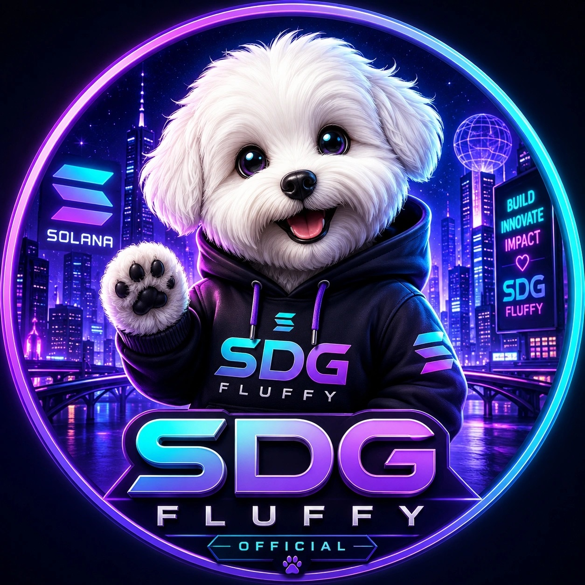

  

# SDG FLUFFY | Web3 Ecosystem on Solana

Building digital asset infrastructure through transparency, governance, utility, and long-term sustainability.

---

## 🚀 About SDG FLUFFY

SDG FLUFFY is a Web3 ecosystem built on Solana, focused on utility-driven digital assets, transparent governance, community development, and sustainable growth.

The ecosystem combines a limited NFT collection, the SDG digital asset, community participation, and infrastructure designed for long-term development.

---

## 🌐 Ecosystem

- **Blockchain:** Solana
- **NFT Collection:** 20,000 NFTs released across 5 phases
- **Phase 1:** Limited hidden mint
- **Digital Asset Supply:** 100,000,000 SDG
- **Long-Term Structure:** 72% of the supply locked through a 4-year journey
- **Community:** International and utility-focused

---

## 🛠 Core Pillars

- **Real Utility:** Digital assets designed to support ecosystem participation.
- **Transparent Governance:** Clear rules, public documentation, and responsible development.
- **Sustainable Growth:** Long-term value over short-term market trends.
- **Security-First Approach:** Safe infrastructure and responsible user interaction.
- **Community Development:** Building an international ecosystem around participation and utility.

---

## 🏗 Technology Stack

- **Blockchain:** Solana
- **NFT Standard:** Metaplex Core
- **Wallet Integration:** Phantom
- **Backend Development:** Python and Flask
- **Database:** SQLite
- **Web Infrastructure:** Browser-based ecosystem tools

---

## 📍 Development Roadmap

### Phase 1 — Foundation

- NFT collection launch
- Community foundation
- Official website
- Initial ecosystem infrastructure

### Phase 2 — Governance and Utility

- Governance tools
- Holder-focused integrations
- Ecosystem participation features
- Infrastructure and security improvements

### Phase 3 — Expansion

- Strategic partnerships
- Advanced utility rollout
- Ecosystem expansion
- International community growth

---

## 📊 Current Status

- Phase 1 NFT collection available
- Official website online
- Community development in progress
- Governance model under development
- Technical documentation published

---

## 🔗 Official Links

- **Website:** [https://sdgfluffy.com](https://sdgfluffy.com)
- **X:** [https://x.com/SDGFluffy](https://x.com/SDGFluffy)
- **YouTube:** [https://youtube.com/@sdgoffcial](https://youtube.com/@sdgoffcial)

---

## ⚠️ Notice

The SDG FLUFFY ecosystem is intended for individuals aged 18 or older. Digital assets involve risk and market volatility. Participants should understand the ecosystem’s utility, governance model, and participation mechanics before engaging.

---

  <strong>Building for the next decade — not the next pump.</strong>

  Built on Solana.

